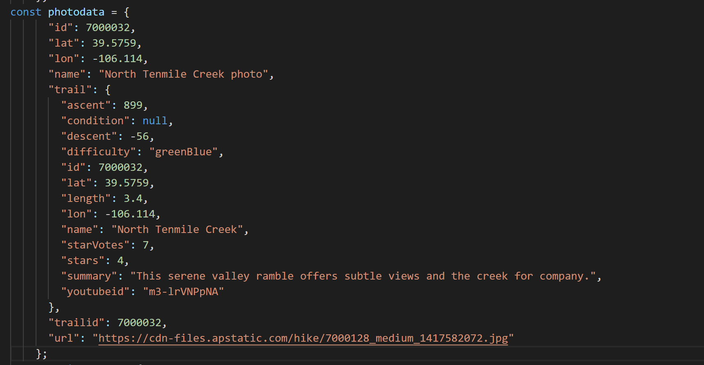

# Hiking Adventures
*Presented to you by: SWEat Victory*

+++

# This is a slide below the title
## Isn't this great!

---

# Meet our members!
* Robert Hale
* David Castilla
* Adolfo Lopez
* Vamsi Ponakala
* Victor Yang
* Alex Dai

---

# Let's take a look at the website

---

# Backend unit testing:
* Tests the validity of our scraper against valid and invalid input
* Tests the robustness of the database against various forms of access

*Let's give it a try*

---

# Frontend testing:

#### Mocha Tests
* Tests ReactJS code for correctness and validity

#### Selenium Tests
* Verifies that frontend is working properly in production
* Verifies that our UI works properly under many situations

*Let's give it a try*

+++

---

# Postman Testing:
* Used to test functionality of API
* Verifies that API handles both valid and invalid input properly

---

# A little self reflection:
* What did we do well?
* What did we learn?
* What can we do better?
* What puzzles us?

---

# Our thoughts as a customer:
* What did they do well?
* What did we learn from their website?
* What can they do better?
* What puzzles us about their website?

---

# Visualization Time