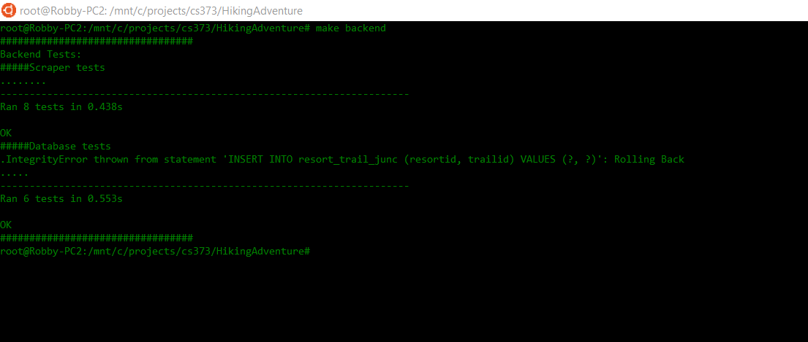
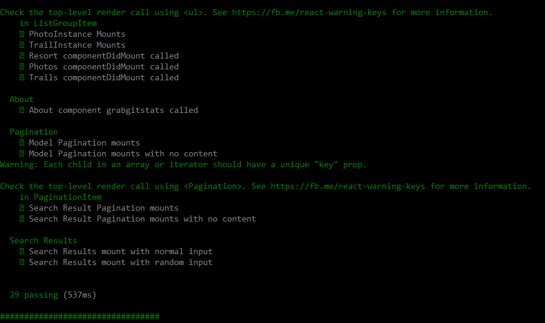
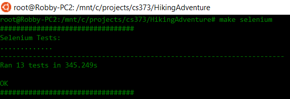
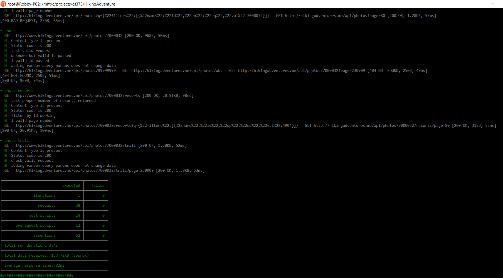

# Hiking Adventures
*Presented to you by: SWEat Victory*

---

# Meet our members!
* Robert Hale
* David Castilla
* Adolfo Lopez
* Vamsi Ponakala
* Victor Yang
* Alex Dai

---

# Let's take a look at the website

---

# Backend unit testing:
* Tests the validity of our scraper against valid and invalid input
* Tests the robustness of the database against various forms of access

+++

# Backend Tests

---

# Frontend testing:

#### Mocha Tests
* Tests ReactJS code for correctness and validity

#### Selenium Tests
* Verifies that frontend is working properly in production
* Verifies that our UI works properly under many situations

+++

# Mocha Tests

+++

# Selenium Tests

---

# Postman Testing:
* Used to test functionality of API
* Verifies that API handles both valid and invalid input properly

+++

# Postman Tests

---

# A little self reflection:

+++

## What did we do well?
* Worked with customers to make sure website was appealing to them
* Testing our code often

+++

## What did we learn?
* The importance of refactoring
* The importance of proper communication between front and back end

+++

## What can we do better?
* More thorough testing
* Clean up the UI to make it more beautiful

+++

## What puzzles us?
* Flask-restless
* YouTube video loading

---

# Our thoughts as a customer:

+++

## What did they do well?
* Beautiful Website with a very user friendly UI
* Many media options for each modal

+++

## What did we learn from their website?
* The importance of UI in making a site inviting
* How to better incorporate media into all modals

+++

## What can they do better?
* Better formatting of text

+++

## What puzzles us about their website?
* Filtering and their API

---

# Visualization Time